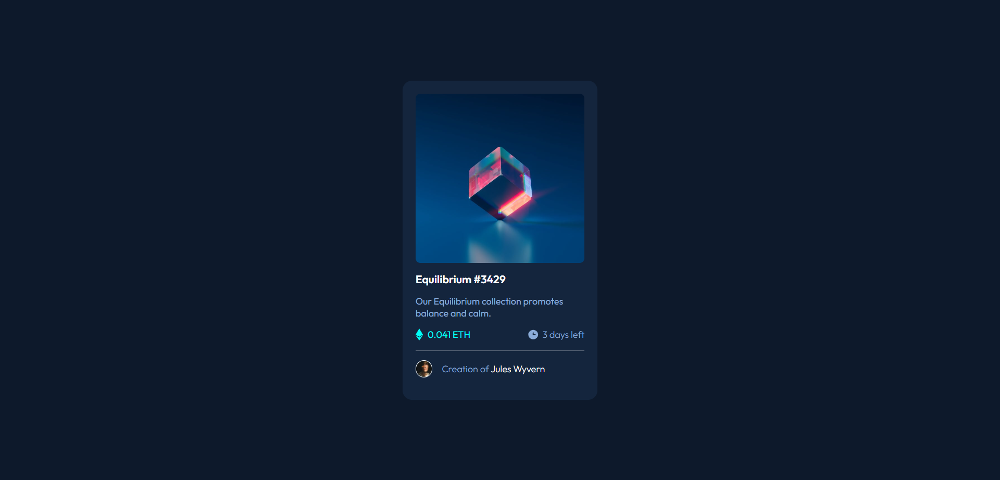

# Frontend Mentor - NFT preview card component solution

This is a solution to the [NFT preview card component challenge on Frontend Mentor](https://www.frontendmentor.io/challenges/nft-preview-card-component-SbdUL_w0U). Frontend Mentor challenges help you improve your coding skills by building realistic projects. 

## Table of contents

- [Overview](#overview)
  - [The challenge](#the-challenge)
  - [Screenshot](#screenshot)
  - [Links](#links)
- [My process](#my-process)
  - [Built with](#built-with)
  - [What I learned](#what-i-learned)
  - [Continued development](#continued-development)
  - [Useful resources](#useful-resources)
- [Author](#author)

## Overview

### The challenge

Users should be able to:

- View the optimal layout depending on their device's screen size
- See hover states for interactive elements

### Screenshot

### Links

- Live Site URL: [Live site on Netlify](https://rakiit-nft-card-component.netlify.app/)

## My process

### Built with

- Semantic HTML5 markup
- CSS custom properties
- Flexbox

### What I learned

Through this project I learned how to create an image overlay icon with the pseudo class hover which I think was the hardest part to complete.

### Continued development

I would like to learn Flexbox, and pseudo classes more in depth. As a person who is starting I found quite difficult to came up with a complete solution by myself, but I manage to do a lot of things as well so I think I just need more practice to master this :D.

### Useful resources

- [How to make an image overlay icon](https://www.w3schools.com/howto/howto_css_image_overlay_icon.asp) - This helped me with the creation of the image overlay icon.
- [Styles for 
's](https://css-tricks.com/examples/hrs/) - This other resource helped me with the styling of the hr that the card has.

## Author

- Website - [Ricardo Irvin Arce Díaz](https://ricardoirvinarcediaz.com/)
- Frontend Mentor - [@Rakiit](https://www.frontendmentor.io/profile/Rakiit)
- Twitter - [@ricardoiarced](https://twitter.com/ricardoiarced)